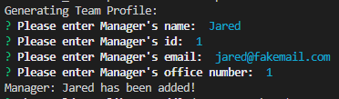
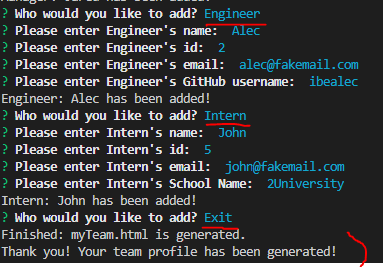
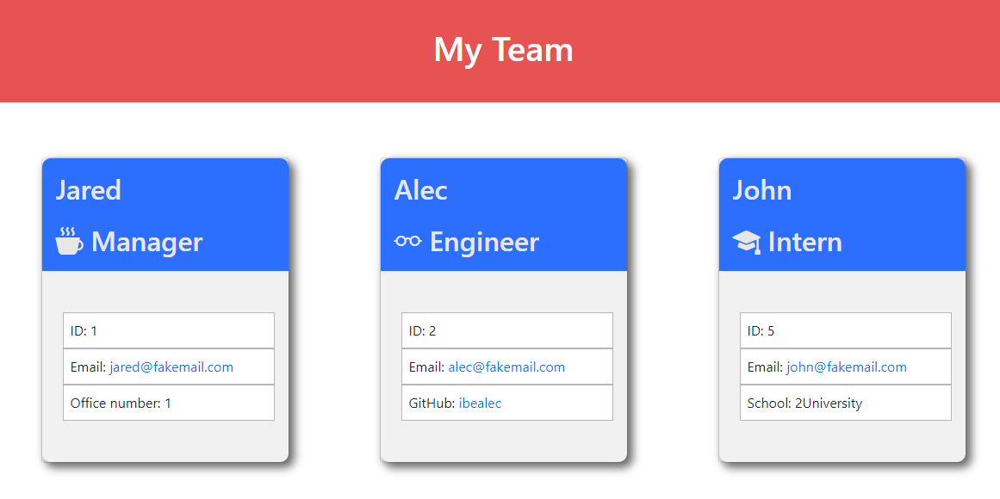
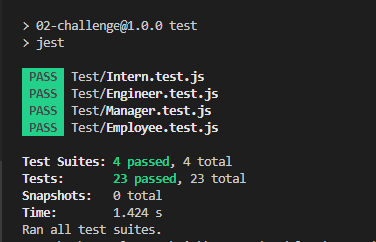

# Team Profile Generator

## Task

This task is to build a Node.js command-line application that takes in information about employees on a software engineering team, then generates an HTML webpage that displays summaries for each person. 

In this challenge, `Inquirer(8.2.4)` npm package was used for inquirer function.

In order to make code maintainable, there are also unit tests for js class files using `jest` npm package.


## User Story

```md
AS A manager
I WANT to generate a webpage that displays my team's basic info
SO THAT I have quick access to their emails and GitHub profiles
```

## Acceptance Criteria

```md
GIVEN a command-line application that accepts user input
WHEN I am prompted for my team members and their information
THEN an HTML file is generated that displays a nicely formatted team roster based on user input
WHEN I click on an email address in the HTML
THEN my default email program opens and populates the TO field of the email with the address
WHEN I click on the GitHub username
THEN that GitHub profile opens in a new tab
WHEN I start the application
THEN I am prompted to enter the team manager’s name, employee ID, email address, and office number
WHEN I enter the team manager’s name, employee ID, email address, and office number
THEN I am presented with a menu with the option to add an engineer or an intern or to finish building my team
WHEN I select the engineer option
THEN I am prompted to enter the engineer’s name, ID, email, and GitHub username, and I am taken back to the menu
WHEN I select the intern option
THEN I am prompted to enter the intern’s name, ID, email, and school, and I am taken back to the menu
WHEN I decide to finish building my team
THEN I exit the application, and the HTML is generated
```

## Description
 * [Link to Video Demonstration](https://drive.google.com/file/d/1YzEcorJo3RD_Yfl7YnDkvRv42mB-kzx1/view)

When the user runs the application with command, bash terminal will come up with questions needed for generating html of team profiles. It starts with questions for Team Manager's profile and user must provide inquired inputs.



After the user provides Manager's profile, they are given options to add other team members (either engineer or intern) or to exit. If the user choose to add another member(s), just like Manager's profile, user needs to provide information for team member's profile.

Below are the information asked for each of the team members:

  * Manager: Name, ID, email, office number
  * Engineer: Name, ID, email, GitHub username (no @ needed)
  * Intern: Name, ID, email, School name

After providing all information, user can choose 'exit' to exit the app and generate html file for team profiles.  





(Example myTeam.html file is lncluded in 'dist' directory.)


## How to Use
The application will be invoked by using the following command:

```bash
node index.js
```

* After initiating the app with the command, it will prompt the user to provide inputs for generating html file for team profiles.

* The app always starts with questions for Team Manager's profile. After inputing Manager's details, then user can add other employee(s)/team member(s), such as engineer and intern. (User must provide details for every inputs, correct id (digits), and valid email address.)

* After adding all team members, select exit to generate Team Profile html page. 

* "myTeam.html" file will be **generated in 'dist' folder**.

* There are also test cases for class employee, manager, engineer, and intern under 'Test' directory. To run the test, use the following command:

```bash
npm test
```




## Credits
* npm [Inquirer package](https://www.npmjs.com/package/inquirer/v/8.2.4) 
* npm [jest package](https://www.npmjs.com/package/jest)
* [Bootstrap Icons](https://icons.getbootstrap.com/)
* Code to check if the value is number: https://stackoverflow.com/questions/1779013/check-if-string-contains-only-digits

---
© 2023 edX Boot Camps LLC. Confidential and Proprietary. All Rights Reserved.
